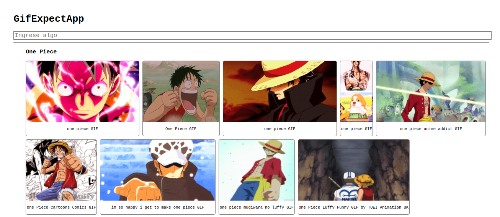

# GifExpertApp

Esta aplicación de React es básica, y es la segunda aplicación del curso de React de Fernando Herrera, por lo que en ella se usan los conceptos básicos sobre las componentes, como comunicar las mismas y algunas cosas sencillas de los Hooks. También implementa mi primer Custom Hook.

La aplicación no está muy bien trabajada con css, ya que el objetivo era aprender React.

## Aplicación



Esta aplicación es un sencillo buscador de gifs usando esta [API](https://developers.giphy.com/), la cual nos proporciona muchos gifs que luego en la aplicación mostramos, en base a las busquedas realizadas por el usuario.

Tambien uso un poquito la libreria de css [animate.css](https://animate.style/), la cual nos proporciona muchas animaciones chulas, simplificando bastante el trabajo.

[Demas partes de Curso](https://github.com/cmglezpdev/Guide-React-Course)

## Mas sobre React

### 1. Componentes

Una componente es una pequeña porción de códido reutilizable que se encarga de renderizar una parte de la aplicación. Se puede dividir por funcionalidades y puedes tener tantas componentes como necesites. Estas tambien pueden tener estados, por lo que cada vez que un estado cambia(que el html cambie por ejemplo) este es capaz de renderizar solo la parte que cambió, haciendolo muy eficientemente.
Una componente es una función común y corriente de JavaScript que siempre retorna código html.

Ejemplos:

**GifExpectApp:** Renderiza toda la aplicación.

**AddCategory:** Se encarga de leer el input y de avisar cuando se introduce una nueva búsqueda.

**GifGrid:** Renderiza todos gifs apoyandose de `GifGridItem`.

**GifGridItem:** Renderiza cada uno de los gifs.


### 2. Hooks

Hasta ahora usamos dos Hooks que vienen con React

**useSate:** crea un nuevo estado el cual solo se podrá modificar con su función correspondiente, e inmediatamente React sabra que tiene que actualizar el html pero solo en las partes donde aparezca esa variable.
    
```js
// nuevo estado categories inicializado con "One Piece" y su funcion modificadora setCategories
const [categories, setCategories] = useState( ["One Piece"] );

// modificar el estado
setState( "One Push Man" );
```

**useEffect:** ejecuta una acción cada vez que se renderiza el componente, a menos que especifiques otra cosa. Por ejemplo:

```js
useEffect( () => {
    getGifs( category )
        .then(img => {
            setState({
                data: img,
                loading: false
            })
        });
}, [category]);  // Solo se vuelve a ejecutar si category cambia
```

Este ejecuta su función solo cuando alguno de los estados dentro del arreglo cambia, evitando asi tener que ejecutar la función innecesariamente, ayudando a la optimización de nuestro código.

### 3. Custom Hooks

No son mas que una forma de extraer la lógica de un componente en funciones reutilizables para que sea mas sencillo su uso. Pueden tener estados y se construyen usando una función común y corriente de javascript.

Un ejemplo es el hook que creamos de `useFetchGifs` que se encarga de actualizar la lista de búsquedas realizadas por el usuario cada vez que se realiza una nueva, o sea, que su estado cambie.

```js
const useFetchGifs = ( category ) => {

    const [state, setState] = useState({
        data: [],
        loading: true
    });

    useEffect( () => {
        getGifs( category )
            .then(img => {
                setState({
                    data: img,
                    loading: false
                })
            });
    }, [category]);

    return state;
}
```

Podemos ver que ese crea un estado nuevo usando `useState`, y haciendo uso de `useEffect` actualizamos la lista de imagenes a mostrar si la categoría que recibimos como argumento ha cambiado.


### Instalacion

Es muy simple de instalar para ejecutarlo en tu pc solo con estos dos pasos:

**1. Instalar dependencias**

``` bash
npm install
```

**2. Correr aplicación**

```bash
npm start
```
